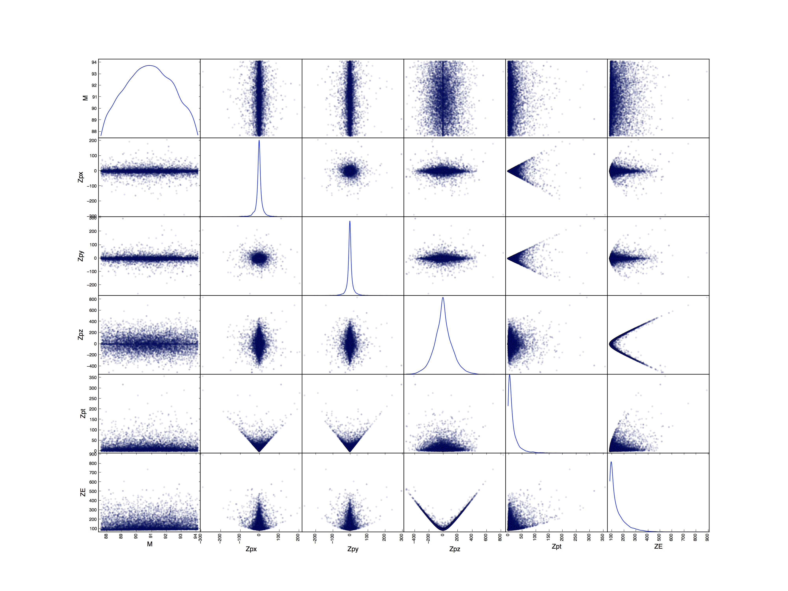
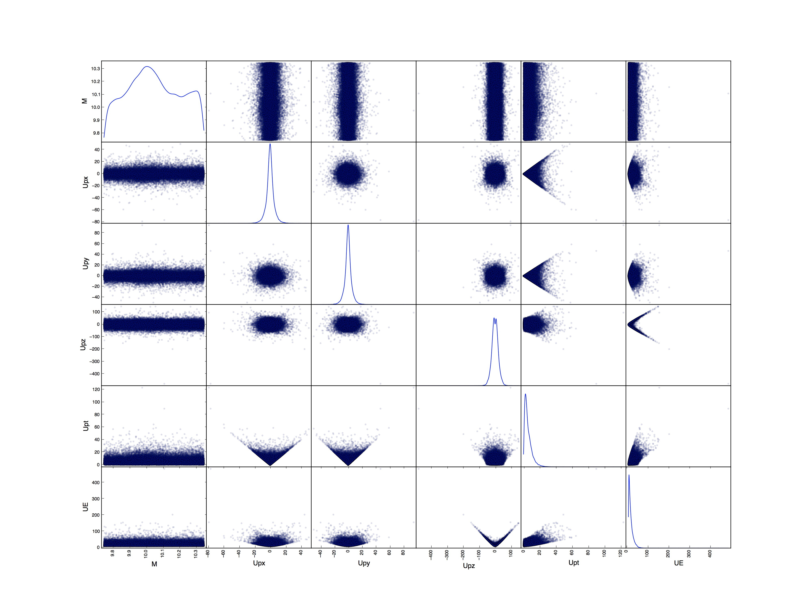

**Nick Tyler**\
Final Project PHYS 723\

CMS Open Data, $X \rightarrow  \mu \mu$  {#cms-open-data-x-rightarrow-mu-mu .unnumbered}
========================================

For my project I used the CMS Open Data platform to get experimental
data of proton proton collisions at $7 TeV$ @OpenData. I used a set of
scripts from GitHub and modified them slightly to read the data and
output results for decays to two $\mu$ @GitHub. For each event the
energy and momentum for each $\mu$ was saved as well as the charge of
each and the mass of the particle the $\mu$ decayed from. In the end I
was able to collect around 3 million individual events.

$Z^0$ Decays {#z0-decays .unnumbered}
============

To find $Z^0$ decays I first made sure that the decays conserved charge
so that $Z^0 \rightarrow  \mu^+ \mu^-$. After the initial charge cut I
was left with roughly 2 million neutral decays. I looked at the mass
histogram in the range above $40\,GeV$ to find the $Z^0$ peak around
$91\,GeV$.\
{width="\textwidth"}\
I then fit a polynomial background with a Gaussian peak around $91\,GeV$
on the data and used this to subtract away the background to find the
$Z^0$ peak.\
{width="\textwidth"}\
I cut the data around around the mass peak and then looked at different
energy and momentum distributions of the decaying $Z^0$.

Scatter Matrix {#scatter-matrix .unnumbered}
--------------

The quickest way to find interesting distributions is by looking at the
matrix of the scatter plots from different combinations of the energy
and momentum directions.\
{width="90.00000%"}\
The two plots that stick out the most initially are the $Z^0$ Energy
versus $Z^0$ Pz and $Z^0$ Energy versus $Z^0$ Pt so I investigated them
more.

$Z^0$ Energy versus $Z^0$ Pz {#z0-energy-versus-z0-pz .unnumbered}
----------------------------

{width="\textwidth"}\
With the color map it is easy to see that most of the $Z^0$ have close
to 0 momentum in the direction of the beam and that they are produced at
energies close to $90\,GeV$. This is characteristic of a symmetric beam
collider like the LHC where particles are created close to the center of
the lab frame. By looking at the projection along the Z momentum axis
it’s clear to see this large peak of $Pz \approx 0$.\
{width="\textwidth"}\
There is a large peak around 0 with a very small distribution at larger
momentums.

$Z^0$ Energy versus $Z^0$ Pt {#z0-energy-versus-z0-pt .unnumbered}
----------------------------

Another interesting distribution is the $Z^0$ Energy versus $Z^0$
transverse momentum. This graph also shows that a large amount of the
$Z^0$ have $Pz \approx 0$\
{width="\textwidth"}\
Looking at the projection along Pt confirms this.\
{width="\textwidth"}\
Combining the results from the two investigations and looking at the
$Z^0$ Pz versus $Z^0$ Pt shows that most of the $Z^0$ have
$P_{total} \approx 0$ meaning that many of the $Z^0$ are created close
to rest in the lab frame. This means that they will decay very quickly
and that the decaying particles will have opposite momentums as they
leave the center of the detector region. This could be helpful in
creating a true background subtraction to find $Z^0$ for this experiment
by only selecting decays which come from the close to the center of the
detector and have $P_{total} \approx 0$ within detector resolutions.\
{width="\textwidth"}\

$\Upsilon$ Decays {#upsilon-decays .unnumbered}
=================

The next region I looked at was the region between $6 - 14\,GeV$ where
the $\Upsilon$ can be found. Again I looked at the mass histogram and
fit a polynomial background with a Gaussian peak this time around
$9.45\,GeV$. The $\chi^2$ for this distribution is much larger than in
the $Z^0$ case because there are two peaks which are not initially fit
but the Gaussian or the polynomial.\
{width="\textwidth"}\
I again subtracted the polynomial background to get the larger peak seen
in green.\
{width="\textwidth"}\
And then after subtracting the background and the larger of the three
peaks I tried to fit the smaller peaks but the simple Gaussian fit
method lumped the two remaining peaks together making it hard to
distinguish between the two.

{width="\textwidth"}\

Scatter Matrix {#scatter-matrix-1 .unnumbered}
--------------

Again to find interesting distributions I looked at the matrix of the
scatter plots and looked at the $\Upsilon$ Energy versus $\Upsilon$ Pz
and $\Upsilon$ Energy versus $\Upsilon$ Pt\
{width="90.00000%"}\

$\Upsilon$ Energy versus $\Upsilon$ Pz {#upsilon-energy-versus-upsilon-pz .unnumbered}
--------------------------------------

{width="\textwidth"}\
This distribution is slightly different then the $Z^0$ distribution.
There is a larger range in the Z momentum distribution opposed to the
large peak around 0 for the $Z^0$. This can also be seen in the wide
distribution seen on the Pz projection.\
{width="\textwidth"}\
However it is hard to tell whether this is due to something physical
with the $\Upsilon$ production or if this is due to the background. A
better investigation into the backgrounds in this region could help to
clear up the the particle identification process.\

$\Upsilon$ Energy versus $\Upsilon$ Pt {#upsilon-energy-versus-upsilon-pt .unnumbered}
--------------------------------------

{width="\textwidth"}\
When first looking at the $\Upsilon$ Energy versus $\Upsilon$ Pt
distribution one can see that there are a lot of events around the low
energy, low momentum region. In closer instigation in this region there
seems to be two bands appearing. The first band follows an arc with a
slope close to one while the other is a wider and shallower band
continuing in the low $Pt \approx 5\,GeV$ region.

{width="\textwidth"}\
{width="\textwidth"}\
With higher statistics this could become interesting to use this either
for background subtraction or to look at the properties of high
transverse momentum $\Upsilon$ versus low transverse momentum
$\Upsilon$.

CMS Open Data: (http://opendata.cern.ch/research/CMS). GitHub DiMuon
Filter: (https://github.com/tpmccauley/dimuon-filter)
